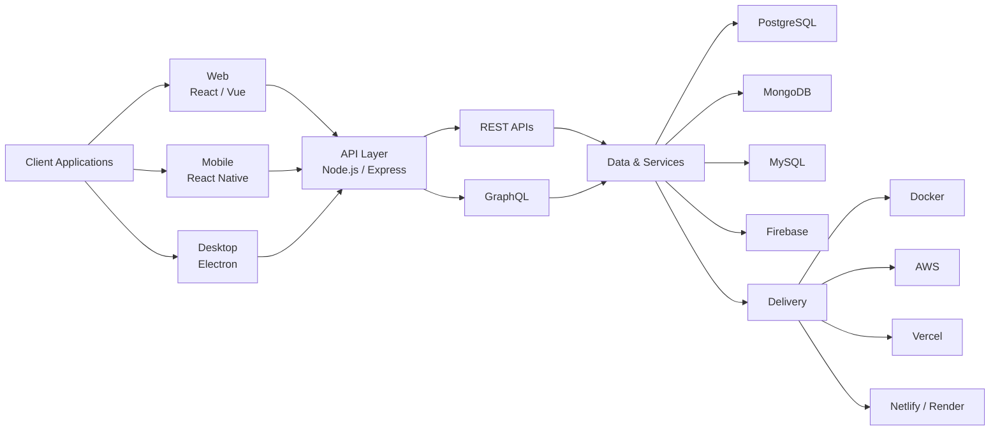
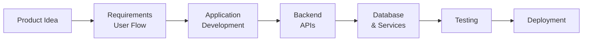

<!-- ========================================================= -->
<!--                 WAQAS GUL — GITHUB PROFILE                -->
<!-- ========================================================= -->

  

  

---

## About Me

I'm **Waqas Gul**, a software developer from Pakistan focused on building complete applications across **web, mobile, and desktop platforms**.

I work across the application stack — from responsive user interfaces and application logic to **backend APIs, databases, authentication, integrations, and deployment**.

My core development stack includes **React.js, React Native, Electron, Node.js, Express.js, PostgreSQL, MongoDB, MySQL, and Firebase**.

> **My focus is building practical, maintainable, and user-friendly software from idea to deployment.**

 

---

## What I Build

<table>

<tr>

<td width="33%" valign="top" align="center">

<h3>Web Applications</h3>

Modern web applications, dashboards, admin panels, LMS platforms, business portals, and full-stack systems.

  

<code>React.js</code>
<code>Vue.js</code>
<code>Node.js</code>

</td>

<td width="33%" valign="top" align="center">

<h3>Mobile Applications</h3>

Cross-platform mobile applications with API integration, authentication, state management, and real-world workflows.

  

<code>React Native</code>
<code>TypeScript</code>
<code>Firebase</code>

</td>

<td width="33%" valign="top" align="center">

<h3>Desktop Applications</h3>

Electron-based desktop applications, internal systems, dashboards, utilities, and productivity-focused software.

  

<code>Electron</code>
<code>React.js</code>
<code>Node.js</code>

</td>

</tr>

</table>

---

## Application Architecture

A high-level view of how I structure complete applications:

---

## Technology Stack

### Frontend Development

  

 

### Mobile & Desktop Development

  

 

### Backend Development

  

 

### Databases & Backend Services

 

### Development Tools & Deployment

  

---

## Core Capabilities

<table>

<tr>

<td width="50%" valign="top">

### Frontend Engineering

- Responsive application interfaces
- Component-based architecture
- React.js development
- Vue.js development
- JavaScript and TypeScript
- State management
- API integration
- Tailwind CSS
- Bootstrap
- Sass

</td>

<td width="50%" valign="top">

### Application Development

- Full-stack web applications
- React Native mobile applications
- Electron desktop applications
- Authentication workflows
- Role-based access systems
- Application state management
- API-driven workflows
- Business application development

</td>

</tr>

<tr>

<td width="50%" valign="top">

### Backend & Data

- Node.js and Express.js
- REST API development
- GraphQL integration
- MongoDB
- PostgreSQL
- MySQL
- Firebase
- Authentication integration
- Database integration

</td>

<td width="50%" valign="top">

### Development & Delivery

- Git and GitHub
- Docker
- Postman
- AWS
- Vercel
- Netlify
- Render
- Firebase
- Application deployment

</td>

</tr>

</table>

---

## Development Workflow

---

## Areas I Work On

  

---

## Featured Work

<table>

<tr>

<td width="50%" valign="top">

### Full-Stack Web Applications

Modern web applications combining responsive interfaces, backend APIs, authentication, and database-driven workflows.

**Core Technologies**

`React.js` `Node.js` `Express.js` `PostgreSQL` `MongoDB`

</td>

<td width="50%" valign="top">

### React Native Applications

Cross-platform mobile applications built around real workflows, backend communication, state management, and reusable UI architecture.

**Core Technologies**

`React Native` `TypeScript` `REST APIs` `Firebase`

</td>

</tr>

<tr>

<td width="50%" valign="top">

### Electron Desktop Applications

Desktop software combining modern web technologies with desktop-specific application workflows.

**Core Technologies**

`Electron` `React.js` `Node.js` `JavaScript`

</td>

<td width="50%" valign="top">

### Backend Systems

API-driven systems with structured application logic, authentication, and relational or document-oriented databases.

**Core Technologies**

`Node.js` `Express.js` `REST` `PostgreSQL` `MongoDB`

</td>

</tr>

</table>

---

## GitHub Analytics

  

---

## Current Focus

<table>

<tr>

<td width="8%" align="center">

</td>

<td width="25%">
<b>React Native</b>
</td>

<td>
Advanced cross-platform mobile application development.
</td>

</tr>

<tr>

<td align="center">

</td>

<td>
<b>Electron</b>
</td>

<td>
Cleaner and more scalable desktop application architecture.
</td>

</tr>

<tr>

<td align="center">

</td>

<td>
<b>Backend Engineering</b>
</td>

<td>
Production-ready APIs and backend application structure.
</td>

</tr>

<tr>

<td align="center">

</td>

<td>
<b>Docker & DevOps</b>
</td>

<td>
Container-based development and deployment workflows.
</td>

</tr>

<tr>

<td align="center">

</td>

<td>
<b>UI / UX Implementation</b>
</td>

<td>
Cleaner, responsive, and easier-to-use application interfaces.
</td>

</tr>

<tr>

<td align="center">

</td>

<td>
<b>Application Architecture</b>
</td>

<td>
Maintainable and scalable full-stack project structures.
</td>

</tr>

</table>

---

## Developer Snapshot

<table>

<tr>
<td width="25%"><b>Role</b></td>
<td>Web, Mobile & Desktop Application Developer</td>
</tr>

<tr>
<td><b>Web</b></td>
<td>React.js • Vue.js</td>
</tr>

<tr>
<td><b>Mobile</b></td>
<td>React Native</td>
</tr>

<tr>
<td><b>Desktop</b></td>
<td>Electron</td>
</tr>

<tr>
<td><b>Backend</b></td>
<td>Node.js • Express.js • REST APIs • GraphQL</td>
</tr>

<tr>
<td><b>Data</b></td>
<td>PostgreSQL • MongoDB • MySQL • Firebase</td>
</tr>

<tr>
<td><b>Tools</b></td>
<td>Git • GitHub • Docker • Postman</td>
</tr>

<tr>
<td><b>Cloud</b></td>
<td>AWS • Vercel • Netlify • Render</td>
</tr>

<tr>
<td><b>Focus</b></td>
<td>Building practical products from idea to deployment</td>
</tr>

</table>

---

## Let's Connect

### Building something interesting?

I'm open to connecting with developers, teams, and people building useful digital products.

  

  

 

