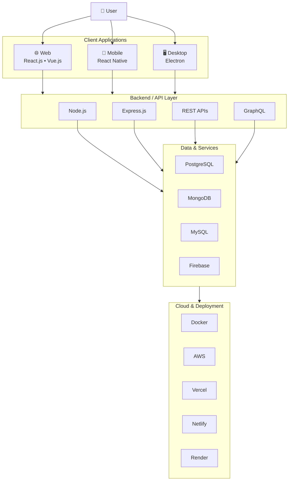

<!-- ========================================================= -->
<!--                     WAQAS GUL PROFILE                      -->
<!-- ========================================================= -->

<div align="center">


<a href="https://git.io/typing-svg">

</a>

<br><br>

<a href="https://wgdeveloper.netlify.app/">

</a>

<a href="https://www.linkedin.com/in/waqas-gul-b7580826b/">

</a>

<a href="mailto:waqasgul369@gmail.com">

</a>

<br><br>


</div>

<br>

---

# 👨‍💻 About Me

I'm **Waqas Gul**, a software developer from Pakistan building complete digital products across **web, mobile, and desktop platforms**.

My work covers the full application lifecycle — from responsive interfaces and application logic to **backend APIs, databases, authentication, integrations, and deployment**.

I primarily work with **React.js, React Native, Electron, Node.js, Express.js, PostgreSQL, MongoDB, and Firebase**.

My goal is simple:

> **Build software that is clean, practical, maintainable, and easy to use.**

<br>

```javascript
const waqas = {
  role: "Web, Mobile & Desktop Application Developer",

  platforms: [
    "Web",
    "Mobile",
    "Desktop"
  ],

  frontend: [
    "React.js",
    "Vue.js",
    "TypeScript",
    "Tailwind CSS"
  ],

  mobile: [
    "React Native"
  ],

  desktop: [
    "Electron"
  ],

  backend: [
    "Node.js",
    "Express.js",
    "REST APIs",
    "GraphQL"
  ],

  databases: [
    "PostgreSQL",
    "MongoDB",
    "MySQL",
    "Firebase"
  ],

  deployment: [
    "AWS",
    "Vercel",
    "Netlify",
    "Render",
    "Firebase"
  ],

  focus: "Building clean, scalable and practical applications"
};
```

---

# 🚀 What I Build

<table>
<tr>

<td width="33%" valign="top">

<h3 align="center">🌐 Web Applications</h3>

<p align="center">
Modern websites, dashboards, admin panels, LMS platforms, business portals and full-stack web applications.
</p>

</td>

<td width="33%" valign="top">

<h3 align="center">📱 Mobile Applications</h3>

<p align="center">
Cross-platform React Native applications with clean interfaces, APIs, authentication, state management and real-world workflows.
</p>

</td>

<td width="33%" valign="top">

<h3 align="center">🖥️ Desktop Applications</h3>

<p align="center">
Electron-based desktop applications, dashboards, internal tools and productivity-focused software.
</p>

</td>

</tr>
</table>

---

# 🧩 Application Architecture

A high-level view of how I approach full application development:



---

# ⚡ Technology Stack

<div align="center">

## Frontend Development


<br><br>

## Mobile & Desktop


<br>


<br><br>

## Backend Development


<br>


<br><br>

## Databases & Backend Services


<br><br>

## Tools • Cloud • Deployment


<br>


</div>

---

# 🛠️ Core Capabilities

<table>

<tr>

<td width="50%" valign="top">

### 🎨 Frontend Engineering

- Responsive user interfaces
- Component-driven development
- React.js applications
- Vue.js applications
- TypeScript & JavaScript
- State management
- API integration
- Tailwind CSS
- Bootstrap
- Sass

</td>

<td width="50%" valign="top">

### 📱 Cross-Platform Development

- React Native mobile applications
- Electron desktop applications
- Cross-platform interfaces
- Authentication flows
- Application state management
- API-driven workflows
- Business application development

</td>

</tr>

<tr>

<td width="50%" valign="top">

### ⚙️ Backend & Data

- Node.js
- Express.js
- REST API development
- GraphQL
- MongoDB
- PostgreSQL
- MySQL
- Firebase
- Authentication systems
- Role-based access systems

</td>

<td width="50%" valign="top">

### ☁️ Development & Delivery

- Git
- GitHub
- Docker
- Postman
- AWS
- Vercel
- Netlify
- Render
- Firebase
- Application deployment

</td>

</tr>

</table>

---

# 🔄 How I Turn Ideas Into Products

```text
                       PRODUCT IDEA
                            │
                            ▼
                 ┌─────────────────────┐
                 │  Requirements       │
                 │  UX & User Flow     │
                 └──────────┬──────────┘
                            │
                            ▼
              ┌───────────────────────────┐
              │      CLIENT LAYER         │
              │                           │
              │ Web   │ Mobile │ Desktop  │
              │ React │ RN     │ Electron │
              └────────────┬──────────────┘
                           │
                           ▼
                  REST API / GraphQL
                           │
                           ▼
                 ┌─────────────────────┐
                 │   BACKEND LAYER     │
                 │ Node.js • Express   │
                 └──────────┬──────────┘
                            │
                            ▼
              ┌─────────────────────────┐
              │     DATA & SERVICES     │
              │                         │
              │ PostgreSQL • MongoDB    │
              │ MySQL • Firebase        │
              └────────────┬────────────┘
                           │
                           ▼
              ┌─────────────────────────┐
              │    BUILD & DELIVERY     │
              │                         │
              │ Docker • AWS • Vercel   │
              │ Netlify • Render        │
              └─────────────────────────┘
```

---

# 📦 Areas I Work On

<div align="center">


<br>


</div>

---

# 📌 Featured Work

<table>

<tr>

<td width="50%" valign="top">

### 🌐 Full-Stack Web Applications

Modern web applications combining responsive interfaces, backend APIs, authentication and database-driven workflows.

**Technologies**

`React.js` `Node.js` `Express.js` `PostgreSQL` `MongoDB`

</td>

<td width="50%" valign="top">

### 📱 React Native Applications

Cross-platform mobile applications built around real workflows, backend communication and reusable interface architecture.

**Technologies**

`React Native` `TypeScript` `REST APIs` `Firebase`

</td>

</tr>

<tr>

<td width="50%" valign="top">

### 🖥️ Electron Desktop Applications

Desktop software and productivity tools combining modern web technologies with desktop application workflows.

**Technologies**

`Electron` `React.js` `Node.js` `JavaScript`

</td>

<td width="50%" valign="top">

### ⚙️ Backend Systems

API-driven systems with structured application logic, authentication and relational or document-oriented databases.

**Technologies**

`Node.js` `Express.js` `REST` `PostgreSQL` `MongoDB`

</td>

</tr>

</table>

> **Note:** Replace this section later with 3–4 of your strongest real GitHub repositories. Real projects will make the profile much stronger than generic cards.

---

# 📊 GitHub Analytics

<div align="center">


<br><br>


</div>

---

# 🎯 Current Focus

<table>

<tr>
<td width="8%" align="center">📱</td>
<td width="27%"><b>React Native</b></td>
<td>Improving advanced cross-platform mobile application development.</td>
</tr>

<tr>
<td align="center">🖥️</td>
<td><b>Electron</b></td>
<td>Building cleaner and more scalable desktop application architecture.</td>
</tr>

<tr>
<td align="center">⚙️</td>
<td><b>Backend Engineering</b></td>
<td>Strengthening production-ready APIs and backend application structure.</td>
</tr>

<tr>
<td align="center">🐳</td>
<td><b>Docker & DevOps</b></td>
<td>Improving container-based development and deployment workflows.</td>
</tr>

<tr>
<td align="center">🎨</td>
<td><b>UI / UX</b></td>
<td>Creating cleaner, more intuitive and responsive application interfaces.</td>
</tr>

<tr>
<td align="center">🏗️</td>
<td><b>Architecture</b></td>
<td>Improving scalable full-stack application structure.</td>
</tr>

</table>

---

# 💡 Development Principles

```yaml
Code:
  - Clean
  - Maintainable
  - Reusable

Interface:
  - Responsive
  - Simple
  - User-friendly

Architecture:
  - Structured
  - Practical
  - Scalable

Goal:
  - Turn ideas into complete digital products
```

---

# 🧠 Developer Snapshot

```javascript
const developer = {
  name: "Waqas Gul",

  role: "Web, Mobile & Desktop Application Developer",

  builds: {
    web: "React.js / Vue.js",
    mobile: "React Native",
    desktop: "Electron",
    backend: "Node.js / Express.js"
  },

  data: [
    "PostgreSQL",
    "MongoDB",
    "MySQL",
    "Firebase"
  ],

  workflow: [
    "Design",
    "Develop",
    "Integrate",
    "Test",
    "Deploy"
  ],

  mindset: "Build practical software that solves real problems"
};
```

---

# 🤝 Let's Connect

<div align="center">

### Building something interesting?

I'm open to connecting with developers, teams and people working on useful digital products.

<br>

<a href="https://wgdeveloper.netlify.app/">

</a>

<a href="https://www.linkedin.com/in/waqas-gul-b7580826b/">

</a>

<a href="mailto:waqasgul369@gmail.com">

</a>

<br><br>


<br>


</div>
