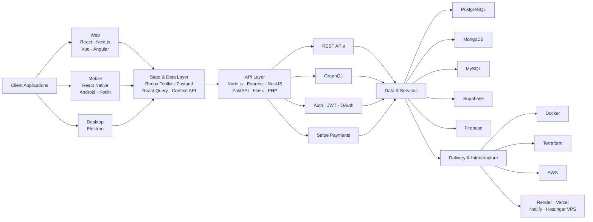
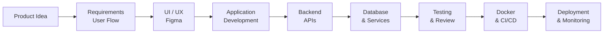

<!-- ========================================================= -->
<!--                 WAQAS GUL — GITHUB PROFILE                -->
<!-- ========================================================= -->

  

  

---

## About Me

I'm **Waqas Gul**, a software developer from Pakistan building complete applications across **web, mobile, and desktop platforms**.

I work across the full application stack — from **pixel-perfect, responsive user interfaces** and application logic to **backend APIs, databases, authentication, third-party integrations, payments, containerization, and deployment**.

My day-to-day stack spans **React.js, Next.js, Vue.js, Angular, React Native, Electron, Node.js, Express.js, NestJS, Python (Flask / FastAPI), PHP, PostgreSQL, MongoDB, Supabase, and Firebase** — deployed on **AWS, Render, Vercel, Netlify, and Hostinger VPS** with **Docker** and **Terraform**.

> **My focus is building practical, maintainable, and user-friendly software — from idea to production deployment.**

 

---

## What I Build

<table>

<tr>

<td width="25%" valign="top" align="center">

<h3>Web Applications</h3>

Modern web apps, SaaS dashboards, admin panels, LMS platforms, business portals, and full-stack systems.

  

<code>React</code>
<code>Next.js</code>
<code>Vue</code>
<code>Angular</code>

</td>

<td width="25%" valign="top" align="center">

<h3>Mobile Applications</h3>

Cross-platform and native mobile applications with API integration, authentication, state management, and real workflows.

  

<code>React Native</code>
<code>Android</code>
<code>Kotlin</code>

</td>

<td width="25%" valign="top" align="center">

<h3>Desktop Applications</h3>

Electron-based desktop software, internal systems, dashboards, utilities, and productivity tools.

  

<code>Electron</code>
<code>React</code>
<code>Node.js</code>

</td>

<td width="25%" valign="top" align="center">

<h3>Backend & APIs</h3>

REST and GraphQL APIs, authentication, payments, integrations, background jobs, and database design.

  

<code>Express</code>
<code>NestJS</code>
<code>FastAPI</code>
<code>Flask</code>

</td>

</tr>

</table>

---

## Application Architecture

A high-level view of how I structure complete applications:

---

## Technology Stack

### Languages

  

 

### Frontend Development

  

 

### State Management & Data Fetching

<table>

<tr>

<td align="center" width="11%">

 <b>Redux</b>
</td>

<td align="center" width="11%">

 <b>RTK</b>
</td>

<td align="center" width="11%">

 <b>Zustand</b>
</td>

<td align="center" width="11%">

 <b>React Query</b>
</td>

<td align="center" width="11%">

 <b>TanStack</b>
</td>

<td align="center" width="11%">

 <b>Axios</b>
</td>

<td align="center" width="11%">

 <b>NgRx</b>
</td>

<td align="center" width="11%">

 <b>Context API</b>
</td>

<td align="center" width="11%">

 <b>GraphQL</b>
</td>

</tr>

</table>

 

 

### Mobile & Desktop Development

  

 

### Backend Development & APIs

  

 

### Databases & Backend Services

  

 

### Cloud, Hosting & DevOps

  

 

### Payments & Third-Party Integrations

 

### Tools, Design & Collaboration

  

---

## Core Capabilities

<table>

<tr>

<td width="50%" valign="top">

### Frontend Engineering

- Pixel-perfect Figma to code implementation
- Responsive and mobile-first interfaces
- Component-based architecture and design systems
- React.js and Next.js (SSR, SSG, App Router)
- Vue.js and Angular application development
- JavaScript (ES6+) and TypeScript
- Redux Toolkit, RTK Query, Zustand, NgRx, Context API
- TanStack React Query and data caching
- Tailwind CSS, Material UI, Bootstrap, Sass
- Performance optimization and accessibility

</td>

<td width="50%" valign="top">

### Application Development

- Full-stack web applications and SaaS platforms
- React Native and Expo mobile applications
- Android application development (Java / Kotlin)
- Electron desktop applications
- Authentication and role-based access control
- Multi-tenant and admin dashboard systems
- Real-time features with Socket.IO
- Stripe payments, subscriptions, and webhooks
- Third-party API and service integration
- Business and internal tooling development

</td>

</tr>

<tr>

<td width="50%" valign="top">

### Backend & Data

- Node.js, Express.js, and NestJS services
- Python backends with Flask and FastAPI
- PHP and Laravel application work
- REST API design and GraphQL integration
- PostgreSQL, MySQL, and SQL query optimization
- MongoDB and Mongoose data modelling
- Supabase and Firebase backend services
- Prisma ORM and database migrations
- Redis caching and background jobs
- DBeaver, pgAdmin, and Compass for DB management

</td>

<td width="50%" valign="top">

### DevOps & Delivery

- Git, GitHub, and GitLab workflows
- Docker containerization and Compose setups
- Terraform infrastructure as code
- AWS services (EC2, S3, RDS, Lambda)
- Hostinger VPS and Linux server administration
- Nginx reverse proxy, SSL, and domain setup
- Render, Vercel, and Netlify deployments
- CI/CD pipelines with GitHub Actions
- Postman API testing and documentation
- ClickUp, Jira, and Agile team collaboration

</td>

</tr>

</table>

---

## Development Workflow

---

## Areas I Work On

  

---

## Featured Work

<table>

<tr>

<td width="50%" valign="top">

### Full-Stack Web Applications

Modern web platforms combining pixel-perfect responsive interfaces, backend APIs, authentication, payments, and database-driven workflows.

**Core Technologies**

`React.js` `Next.js` `TypeScript` `Node.js` `Express.js` `PostgreSQL` `MongoDB` `Stripe`

</td>

<td width="50%" valign="top">

### Mobile Applications

Cross-platform mobile apps built around real workflows, backend communication, offline handling, state management, and reusable UI architecture.

**Core Technologies**

`React Native` `Expo` `TypeScript` `REST APIs` `Firebase` `Kotlin` `Android`

</td>

</tr>

<tr>

<td width="50%" valign="top">

### Electron Desktop Applications

Desktop software combining modern web technologies with desktop-specific workflows — offline storage, native menus, auto-update, and packaging.

**Core Technologies**

`Electron` `React.js` `Node.js` `SQLite` `TypeScript`

</td>

<td width="50%" valign="top">

### Backend & API Systems

API-driven systems with structured application logic, authentication, payments, and relational or document-oriented databases.

**Core Technologies**

`NestJS` `Express.js` `FastAPI` `Flask` `GraphQL` `PostgreSQL` `MongoDB` `Prisma`

</td>

</tr>

<tr>

<td width="50%" valign="top">

### Cloud & Deployment

Containerized applications deployed to cloud and VPS environments with reverse proxies, SSL, environment management, and CI/CD pipelines.

**Core Technologies**

`Docker` `Terraform` `AWS` `Nginx` `Hostinger VPS` `Render` `GitHub Actions`

</td>

<td width="50%" valign="top">

### Pixel-Perfect UI Implementation

Design-to-code work that turns Figma files into accurate, responsive, and accessible production interfaces.

**Core Technologies**

`Figma` `Tailwind CSS` `Material UI` `Sass` `Framer Motion`

</td>

</tr>

</table>

---

## GitHub Analytics

  

  

---

## Current Focus

<table>

<tr>

<td width="8%" align="center">

</td>

<td width="25%">
<b>Next.js & React</b>
</td>

<td>
Server-side rendering, App Router patterns, and scalable frontend architecture.
</td>

</tr>

<tr>

<td align="center">

</td>

<td>
<b>React Native</b>
</td>

<td>
Advanced cross-platform mobile development and native module integration.
</td>

</tr>

<tr>

<td align="center">

</td>

<td>
<b>NestJS & FastAPI</b>
</td>

<td>
Production-ready, well-structured APIs across the Node.js and Python ecosystems.
</td>

</tr>

<tr>

<td align="center">

</td>

<td>
<b>Docker & Terraform</b>
</td>

<td>
Container-based workflows and infrastructure as code for repeatable deployments.
</td>

</tr>

<tr>

<td align="center">

</td>

<td>
<b>AWS & VPS</b>
</td>

<td>
Cloud services, Linux server administration, Nginx, and SSL configuration.
</td>

</tr>

<tr>

<td align="center">

</td>

<td>
<b>Databases</b>
</td>

<td>
PostgreSQL and Supabase modelling, indexing, and query performance.
</td>

</tr>

<tr>

<td align="center">

</td>

<td>
<b>Pixel-Perfect UI</b>
</td>

<td>
Accurate design-to-code implementation with strong responsive behaviour.
</td>

</tr>

<tr>

<td align="center">

</td>

<td>
<b>Electron</b>
</td>

<td>
Cleaner, more scalable desktop application architecture and packaging.
</td>

</tr>

</table>

---

## Developer Snapshot

<table>

<tr>
<td width="22%"><b>Role</b></td>
<td>Full-Stack Web, Mobile & Desktop Application Developer</td>
</tr>

<tr>
<td><b>Languages</b></td>
<td>JavaScript • TypeScript • Python • PHP • Java • Kotlin • C++ • SQL</td>
</tr>

<tr>
<td><b>Web</b></td>
<td>React.js • Next.js • Vue.js • Angular • Tailwind CSS • Material UI • Bootstrap • Sass</td>
</tr>

<tr>
<td><b>State</b></td>
<td>Redux • Redux Toolkit (RTK) • RTK Query • Zustand • React Query • NgRx • Context API</td>
</tr>

<tr>
<td><b>Mobile</b></td>
<td>React Native • Expo • Android • Kotlin • Java</td>
</tr>

<tr>
<td><b>Desktop</b></td>
<td>Electron</td>
</tr>

<tr>
<td><b>Backend</b></td>
<td>Node.js • Express.js • NestJS • Flask • FastAPI • PHP • Laravel • REST APIs • GraphQL</td>
</tr>

<tr>
<td><b>Data</b></td>
<td>PostgreSQL • MySQL • MongoDB • Supabase • Firebase • Redis • Prisma • DBeaver</td>
</tr>

<tr>
<td><b>Cloud & Hosting</b></td>
<td>AWS • Render • Vercel • Netlify • Hostinger VPS • Nginx • Cloudflare</td>
</tr>

<tr>
<td><b>DevOps</b></td>
<td>Docker • Terraform • GitHub Actions • CI/CD • Linux</td>
</tr>

<tr>
<td><b>Payments</b></td>
<td>Stripe (Checkout, Subscriptions, Webhooks) • PayPal</td>
</tr>

<tr>
<td><b>Tools</b></td>
<td>Git • GitHub • GitLab • Postman • Figma • VS Code • ClickUp • Jira • Slack</td>
</tr>

<tr>
<td><b>Focus</b></td>
<td>Building practical products from idea to production deployment</td>
</tr>

</table>

---

## Let's Connect

### Building something interesting?

I'm open to connecting with developers, teams, and people building useful digital products.

  

  

 

